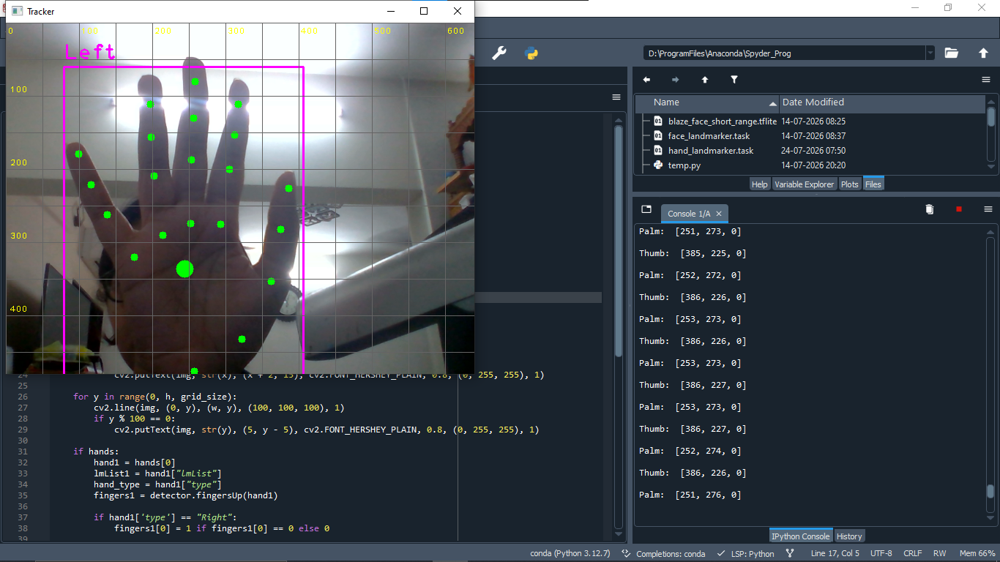

# virtual-mouse
Virtual mouse application that utilizes a computer vision framework via a standard webcam to detect hand landmarks and seamlessly map real-time finger movements to onscreen cursor coordinates.

A virtual mouse application that utilizes a computer vision framework via a standard webcam to detect hand landmarks and seamlessly map real-time finger movements to onscreen cursor coordinates. While the project is still a work in progress, its current capabilities successfully include high-accuracy tracking of the index finger for navigation, an automated gesture recognition command that triggers a system action to close the active window, and a dedicated exit gesture that safely terminates the entire tracking script.

[]
